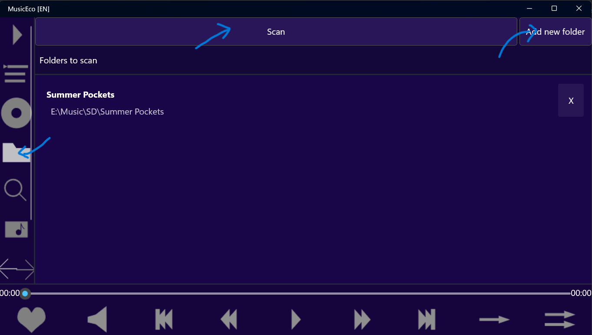
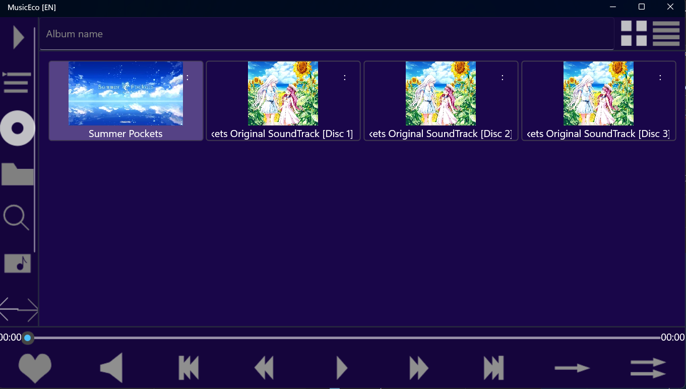
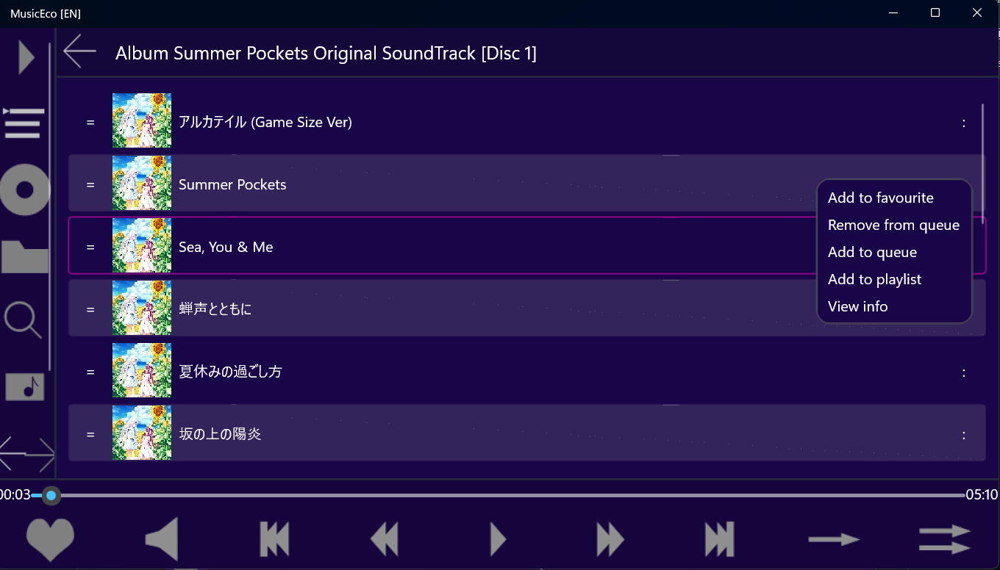

# MusicEco
**MusicEco** is a unified local music player and manger designed for cross-platfform use. Build with flexibility and performance, it support feature-rich music library experience from file scanning, playback count and UI styling.
## 🌟 Features
- **Music Scanning**: Add folders and scan for music files. MusicEco organizes them by album, folder.
- **Library Management**:
  - Browse by albums, folders or favourites.
  - Custom playist creation
  - Track recent playback history in a queue.
- **Search and Navigation**:
  - Album-based and title-based search
  - Built-in custom file explorer
- **Favourite and Statistics**:
  - Mark favourite songs.
  - View playback count and recent history.
- **UI customization**:
  - Color theme
  - Display orientation
  - UI scale
- **Playback control**
  - Support basic seek, play/pause, next/previous.
  - Support repeat current track and shuffle current queue.
- **Android-ready**:
  - Pre-support for Android.

## 🛠️ Tech Stack
- [C# MAUI 10.0](https://learn.microsoft.com/en-us/dotnet/maui/)
- [SQLitePCLRaw](https://github.com/ericsink/SQLitePCL.raw)
- [FFmpeg](https://github.com/ffmpeg/ffmpeg)
- [Blake3](https://github.com/BLAKE3-team/BLAKE3)
- [SkiaSharp](https://github.com/mono/skiasharp)
- [NAudio](https://github.com/naudio/NAudio)
- [TagLib#](https://github.com/mono/taglib-sharp)

## 🚀 Installation
1. Download the lastest release from [Releases](https://github.com/Azurshi/MusicEco/releases)
2. Installation:
  -  For Android: Install .apk file
  -  For Window: Install certificate file (.cer), then install MSIX file (.msix)
     - Certificate:  Install Certificate -> Local Machine -> Place All certificates in the following store -> Browse -> Trusted People -> Finish.

## ▶️ Usage Instruction
1. Open the app and go to [Explorer](MusicEco/Resources/Images/explorer.png) -> Scan
     
3. Add your music folder(s) to the scan list.
4. Tap **Scan** button and wait for processing to complete.
5. Once scanned, you can:
   - Browse by album or folder.
     
   - Create and edit custom playlists.
   - Add songs to playlists or queues via each song option menu ':'
     
   - Play song by click into song title.
## 📋 Known issues
- Low performance on Windows: UI may freeze around <1 second when display grid data.
- Real audio position may deviated up to 500ms depend on OS.
- Android permissions may be revoked by OS, re-select scan folder(s) to re-apply permissions.
- Development output may sometime show up in UI.
## 🗺 Roadmap
- Better support for Android.
- Cloud sync for user data.
- Play song from cloud.
- New theme/style.
- Support for missing files.
- Extensions (Audio visualization, Youtube downloader, ...)
- AI intergration.
- Tag editing support.
## 🤝 Contributing
This project is closed to outside contributions.
## 📄 Lincense
MusicEco is lincensed under the **GNU GPL v3.0**. See the [Lincense](./LINCENSE) for details.
## 🙌 Credits
- Developed solely by [Azurshi](https://github.com/Azurshi) with [Anh39](https://github.com/Anh39) as school account.
- Special thanks to open-source community and libraries.
## Notice
Contact me at vdanh3904@gmail.com if you need any preview images removed due to copyright violation.
